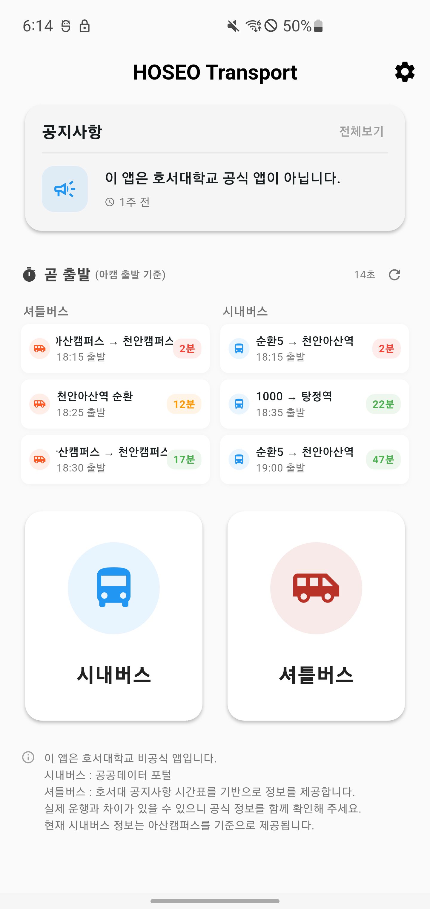

# 호통 (hsro)

호서대학교 통학 이동 정보를 한곳에서 보는 비공식 Flutter 앱입니다.  
셔틀버스, 시내버스, 지하철(1호선) 정보를 통합해 제공합니다.



## 프로젝트 개요

- 앱 이름: `호통`
- 패키지: `hsro`
- 현재 앱 버전: `1.1.3+55`
- 주요 타겟: `Android`, `iOS`
- 상태 관리: `GetX`

## 주요 기능

### 1) 홈
- 최신 공지 1건 요약 + 전체 공지 이동
- `곧 출발` 위젯으로 셔틀/시내버스 임박 운행 정보 표시
- 캠퍼스(아산/천안) 즉시 전환

### 2) 공지/긴급 공지
- 일반 공지: 최신 1건 + 목록 + 유형 필터
- 긴급 공지: 카테고리(셔틀/시내버스/지하철)별 배너 노출
- Markdown 본문 렌더링 및 외부 링크 이동

### 3) 셔틀버스
- 노선/날짜별 시간표 조회
- 회차별 정류장 도착 시각 조회
- 정류장 상세(설명/지도) 확인
- 내 위치 기반 주변 정류장 정렬 및 정류장별 시간표 조회

### 4) 시내버스
- 캠퍼스별 노선 그룹 화면 제공
- 실시간 운행 위치(WebSocket) 반영
- 노선 경로/정류장 데이터는 로컬 JSON 에셋 사용
- 노선별 다음 출발 시간 표시

### 5) 지하철(천안역/아산역)
- 실시간 도착 정보(WebSocket)
- 역/요일 유형별 시간표 조회 API 연동

## 기술 스택

- Framework: `Flutter`, `Dart`
- State Management / Navigation: `get`
- Network: `http`, `web_socket_channel`
- Map: `flutter_map`, `flutter_naver_map`, `latlong2`
- Local Storage: `shared_preferences`
- Location: `geolocator`
- UI/Utility: `intl`, `flutter_markdown`, `url_launcher`, `tutorial_coach_mark`

## 프로젝트 구조

```text
lib/
  main.dart
  models/                # 도메인 모델
  repository/            # API 접근 레이어
  utils/                 # 환경설정, 위치, 시간표 로더 등
  viewmodel/             # GetX ViewModel
  view/                  # 화면 및 공통 UI 컴포넌트
assets/
  bus_routes/            # 시내버스 노선 GeoJSON
  bus_stops/             # 시내버스 정류장 JSON
  bus_times/             # 시내버스 시간표 JSON(버전 관리)
  Holiday/               # 공휴일 데이터
  icons/
```

## 시작하기

### 1) 요구사항
- Flutter SDK 설치
- Dart SDK `>= 3.6.1 < 4.0.0` (`pubspec.yaml` 기준)
- iOS 빌드 시 Xcode/CocoaPods, Android 빌드 시 Android Studio SDK

### 2) 의존성 설치
```bash
flutter pub get
```

### 3) 환경 변수 파일 설정
앱은 `assets/.env` 파일을 읽습니다.

```dotenv
NAVER_MAP_CLIENT_ID=YOUR_NAVER_MAP_CLIENT_ID
BASE_URL=https://YOUR_BACKEND_BASE_URL
APPLE_APP_ID=YOUR_APPLE_APP_ID
PLAY_STORE_ID=YOUR_PLAY_STORE_ID
```

키 설명:

- `NAVER_MAP_CLIENT_ID`: 네이버 지도 SDK 인증 키
- `BASE_URL`: 백엔드 API 베이스 URL (예: `https://example.com`)
- `APPLE_APP_ID`: 앱스토어 업데이트 체크용 앱 ID
- `PLAY_STORE_ID`: 플레이스토어 업데이트 체크용 패키지 ID

### 4) 실행
```bash
flutter run
```

## 백엔드 연동 포인트

`BASE_URL` 기준으로 아래 엔드포인트를 사용합니다.

- 공지: `/notices/`, `/notices/latest`
- 긴급 공지: `/emergency-notices/latest?category=...`
- 셔틀: `/shuttle/routes`, `/shuttle/schedules-by-date`, `/shuttle/stations` 등
- 시내버스: `/buses`, WebSocket `/ws/bus`
- 지하철: `/subway/schedule`, WebSocket `/subway/ws`

## 데이터 소스 메모

- 시내버스 경로/정류장: 앱 내 에셋(JSON)
- 시내버스 시간표: `assets/bus_times/bus_times.json` 기본 사용
- 앱 시작 시 `BusTimesLoader`가 버전 API를 조회해 최신 파일로 교체 가능

## 개발 명령어

```bash
flutter analyze
flutter test
```

## 참고

- 이 앱은 호서대학교 비공식 앱입니다.
- 위치 권한이 필요한 기능(주변 정류장/내 위치 표시)이 포함되어 있습니다.
